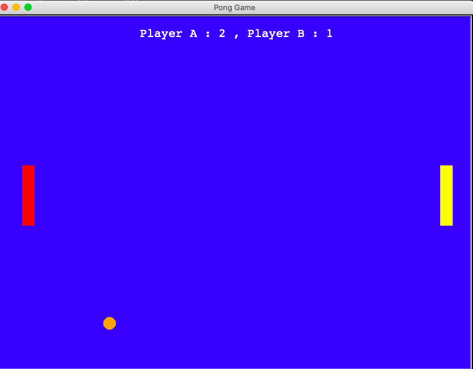

# Pong_Game

I created this game to implement my understanding of Python. This game is created using the Turtle module in Python. 
This game is played by 2 players and the score of a player is updated when the other player misses the ball. 
